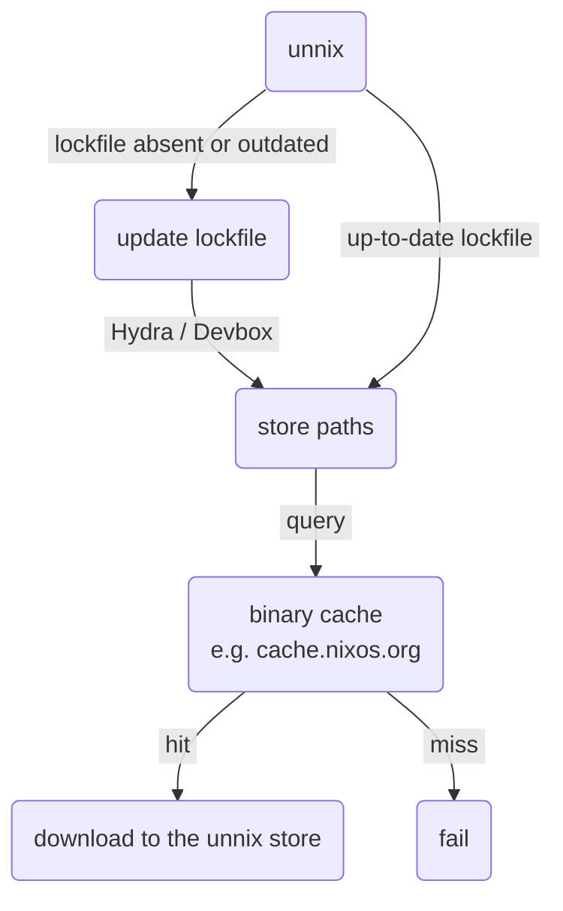

# unnix

[](https://github.com/figsoda/unnix/releases)
[](https://crates.io/crates/unnix)
[](https://deps.rs/repo/github/figsoda/unnix)
[](https://www.mozilla.org/en-US/MPL/2.0)
[](https://github.com/figsoda/unnix/actions/workflows/ci.yml)

Reproducible Nix environments without installing Nix

## Usage

> [!Warning]
> Unnix is alpha software.
> I recommend against running it on long-running production servers in its current state.

<table>
<thead>
  <tr>
    <th>Try with Nix flakes</th>
    <th>Install from crates.io</th>
    <th>Download prebuilt binaries</th>
  </tr>
</thead>
<tr>
  <td>

```bash
nix shell github:figsoda/unnix
```

  </td>
  <td>

```bash
cargo install unnix --locked
```

  </td>

  <td align="center">

[latest release](https://github.com/figsoda/unnix/releases/latest)

  </td>
</tr>
</table>

To use unnix, start by creating `unnix.kdl`, [unnix's manifest file](docs/manifest.md)

```bash
unnix init -p jq ripgrep
```

Now you can enter the environment with

```bash
unnix env
```

This will generate `unnix.lock.json` and put you in a shell with `jq` and `rg`.
Make sure to commit the lockfile to your VCS to keep your environment reproducible.

## How it works

This is a very simplified view of what happens when you run `nix develop`.


Downloading and evaluating Nixpkgs can take a long time,
especially in ephemeral environments like CI pipelines.
Unnix avoids that by removing derivations from the picture altogether,
and getting the store paths directly from services like [Hydra] or [Devbox].



## Platform support

|                             | aarch64-darwin | aarch64-linux | x86_64-darwin | x86_64-linux |
| --------------------------- | -------------- | ------------- | ------------- | ------------ |
| CLI                         | partial[^1]    | yes           | partial[^1]   | yes          |
| [GitHub action]             | yes            | yes           | no            | yes          |
| [prebuilt binaries]         | yes            | yes           | no            | yes          |
| cached by the default cache | yes            | yes           | yes[^2]       | yes          |

[^1]: `unnix env` relies on [bubblewrap], which only works on Linux. An alternative darwin backend is work in progress.

[^2]: [x86_64-darwin will be deprecated in Nixpkgs 26.11.](https://nixos.org/manual/nixpkgs/unstable/release-notes#x86_64-darwin-26.05)

## Limitations

- No setup hooks

  Unnix does not have access to stdenv, and therefore cannot run the setup hooks
  or any user-specified `shellHook`s.
  Instead, it tries its best to emulate the behavior of setup hooks like `pkg-config`,
  so that dependencies can be picked up without executing any hooks.

- No evaluation

  Unnix does not evaluate Nix expressions.
  You cannot use `.override` or `.overrideAttrs` on packages,
  and are limited to the attributes the resolver exposes, e.g. [Hydra] jobs.

- No builds

  Unnix cannot build anything, and strictly relies on binary caches.
  This means no unfree packages if you are using the default set of caches.

## Related projects

- [nix-bundle](https://github.com/nix-community/nix-bundle)

- [runix](https://github.com/timbertson/runix)

## Documentation

See [docs/README.md](docs)

## Changelog

See [CHANGELOG.md](CHANGELOG.md)

[Devbox]: https://www.nixhub.io/
[GitHub action]: https://github.com/figsoda/unnix-action
[Hydra]: https://github.com/nixos/hydra
[bubblewrap]: https://github.com/containers/bubblewrap
[prebuilt binaries]: https://github.com/figsoda/unnix/releases
