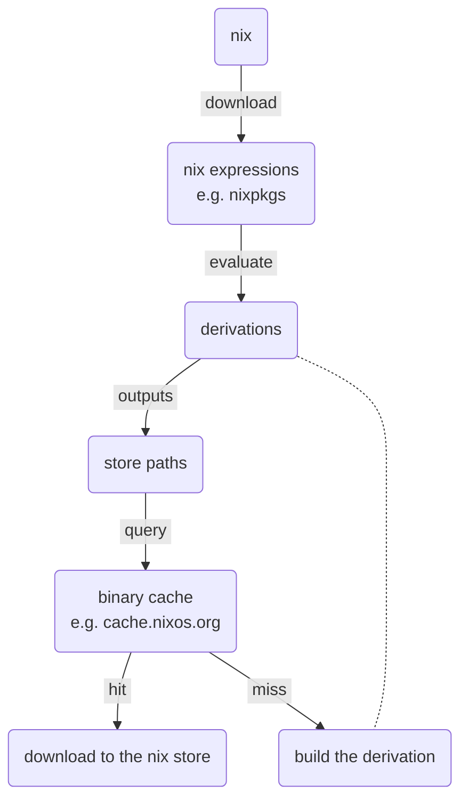
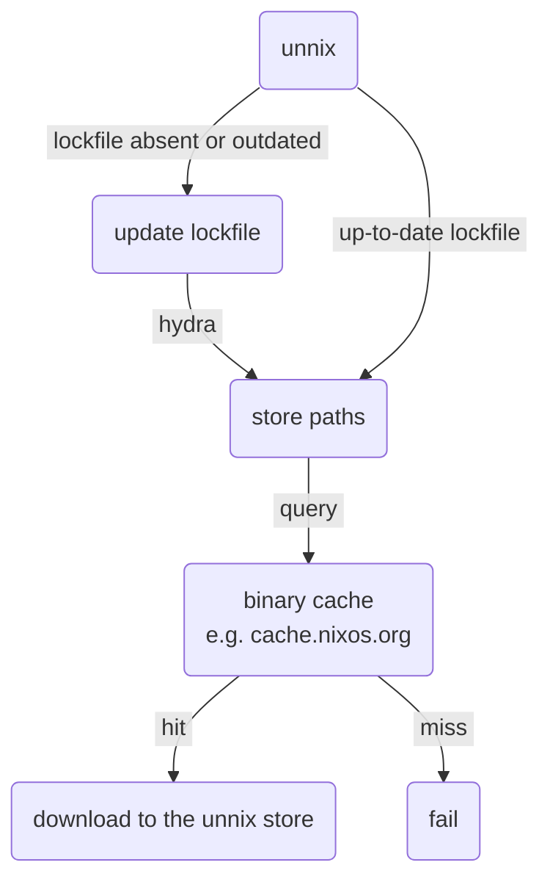

# unnix

Use Nix packages without installing Nix

[](https://github.com/figsoda/unnix/releases)
[](https://crates.io/crates/unnix)
[](https://deps.rs/repo/github/figsoda/unnix)
[](https://www.mozilla.org/en-US/MPL/2.0)
[](https://github.com/figsoda/unnix/actions/workflows/ci.yml)

## Usage

To use unnix, start by creating `unnix.kdl`, unnix's manifest file written in [KDL]

```
unnix init -p jq ripgrep
```

Now you can enter the environment with

```bash
unnix env
```

This will generate `unnix.lock.json` and put you in a shell with `jq` and `rg`.
Make sure to commit the lockfile to your VCS to keep your environment reproducible.

## How it works

This is a very simplified view of what happens when you run `nix develop`.



Downloading and evaluating nixpkgs can take a long time,
especially in ephemeral environments like CI pipelines.
Unnix avoids that by removing derivations from the picture altogether,
and getting the store paths directly from CI systems like [hydra].



## Limitations

- No setup hooks

  Unnix does not have access to stdenv, and therefore cannot run the setup hooks
  or any user-specified `shellHook`s.
  Instead, it tries its best to emulate the behavior of setup hooks like `pkg-config`,
  so that dependencies can be picked up without executing any hooks.

- No evaluation

  Unnix does not evaluate Nix expressions.
  You cannot use `.override` or `.overrideAttrs` on packages,
  and are limited to the attributes your CI systems expose, e.g. [hydra] jobs.

- No builds

  Unnix cannot build anything, and strictly relies on binary caches.
  This means no unfree packages if you are using the default set of caches.

## Related projects

- [nix-bundle](https://github.com/nix-community/nix-bundle)

- [runix](https://github.com/timbertson/runix)

## Changelog

See [CHANGELOG.md](CHANGELOG.md)

[KDL]: https://kdl.dev/
[hydra]: https://github.com/nixos/hydra
